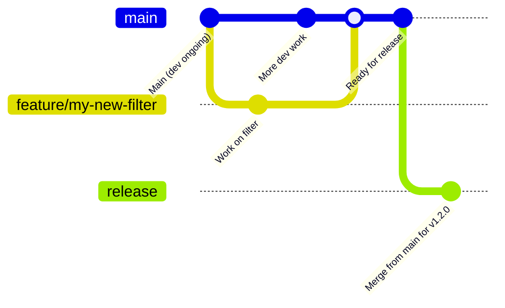
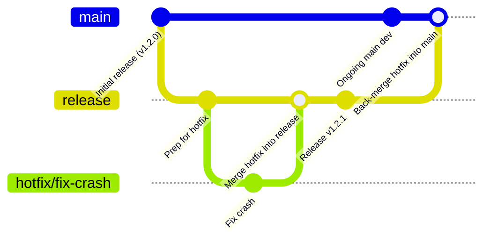

# Contributing to the License Plate Detection Filter

Thanks for your interest in improving the **License Plate Detection Filter**, an OpenFilter-based component for detecting license plates using a custom Faster R-CNN model! 🚘  
Whether you're tuning model performance, fixing bugs in ROI logic, improving I/O or logging, or enhancing documentation — your contributions are appreciated.

This guide helps you:

- Set up your development environment
- Run and write tests
- Run the filter in an OpenFilter pipeline
- Understand our PR and commit process
- Sign your commits using the DCO
- Ask for help or offer improvements

---

## Topics

* [Setting up your development environment](#setting-up-your-development-environment)
* [Running tests](#running-tests)
* [Running with the OpenFilter CLI](#running-with-the-openfilter-cli)
* [Reporting issues](#reporting-issues)
* [Contribution guidelines](#contribution-guidelines)
  * [Pull request process](#pull-request-process)
  * [Commit message format](#commit-message-format)
  * [Sign your commits (DCO)](#sign-your-commits-dco)
* [Style and conventions](#style-and-conventions)
* [Release process](#release-process)
* [Thank you](#thank-you-🙏)

---

## Setting up your development environment

The License Plate Detection Filter is a standalone Python package that uses [OpenFilter](https://github.com/PlainsightAI/openfilter) as its framework and PyTorch for detection.

To get started:

```bash
git clone git@github.com:PlainsightAI/filter-license-plate-detection.git
cd filter-license-plate-detection
# Optional but recommended: python -m venv venv && source venv/bin/activate
make install
````

Ensure you have a valid PyTorch installation and the correct CUDA setup (if using GPU).

---

## Running tests

Run tests with:

```bash
make test
```

Or run a specific test file:

```bash
pytest -v tests/test_filter_license_plate_detection.py
```

Tests validate:

* Model loading and inference
* Detection filtering (e.g., confidence thresholding)
* Polygon ROI forwarding
* JSON output formatting
* Edge case handling (e.g., skipped frames, no detections)

Please include tests when making changes to core logic in `process()` or `setup()`.

---

## Running with the OpenFilter CLI

You can test the filter in a real-time OpenFilter pipeline:

```bash
openfilter run \
  - VideoIn --sources 'file://example_video.mp4!loop' \
  - filter_license_plate_detection.filter.FilterLicensePlateDetection \
      --model_path ./model.pth \
      --forward_detection_rois true \
      --write_detections_to_json true \
      --output_json_path ./detections.json \
  - Webvis
```

or simply:

```bash
make run
```

This pipeline will:

* Read video from file
* Run the license plate detector
* Forward ROIs and optionally log results
* Visualize output in a browser

Ensure the model path is correct and accessible.

---

## Reporting issues

If you hit a bug — e.g., model loading fails, JSON output is malformed, or ROIs don’t forward as expected — please [open an issue](https://github.com/PlainsightAI/filter-license-plate-detection/issues) and include:

* A clear description of the issue
* Steps to reproduce (or pipeline snippet)
* Relevant logs, config, or stack traces
* Whether it's model-related, frame-specific, or environmental

We especially appreciate minimal test cases or failing unit tests.

---

## Contribution guidelines

### Pull request process

* Create a feature branch (e.g., `fix-box-scaling`, `add-output-validation`)
* Keep changes focused and well-scoped
* Add tests when changing core logic
* Run `make test` before opening your PR
* Sign your commits using the DCO (see below)
* Open PRs against the `main` branch

Please document any breaking changes to model output format or configuration behavior.

---

### Commit message format

Use this structure:

```
Short description (max 50 chars)

Optional longer explanation and context.
Use "Closes #123" for related issues.
```

Sign your commits with `-s`:

```bash
git commit -s -m "Fix box scaling for downsampled inputs"
```

---

### Sign your commits (DCO)

We require all contributors to sign their commits using the **Developer Certificate of Origin (DCO)**:

```bash
git commit -s -m "Refactor detection loop"
```

This adds a sign-off line like:

```
Signed-off-by: Your Name <your.email@example.com>
```

Unsigned commits will fail CI.

For more information: [developercertificate.org](https://developercertificate.org)

---

## Style and conventions

* Use `black` for code formatting
* Use `ruff` for linting and consistency
* Apply type hints for all public methods, especially in `normalize_config`, `setup`, and `process`
* Comment any non-trivial detection logic or ROI transformations
* Favor readability and explicit logic over premature abstraction

---

### Docstrings

Document:

* Config options in `FilterLicensePlateDetectionConfig`
* Logic in `process()` around confidence filtering and ROI forwarding
* File output format (e.g., JSON logs)
* Frame metadata expectations (e.g., `meta.id`, optional skip flag)

---

## Release Process

OpenFilter uses a structured release workflow to ensure stability, transparency, and traceability of code changes.

Whether you're contributing a quick fix or a large feature, it's important to understand how changes move from your local branch into production.

### 🧵 Development Flow

- All contributors (including maintainers) **branch off of `main`** for any feature, bugfix, or documentation update.
- Pull requests should always **target `main`**, which serves as the active development branch.
- Once PRs are approved and merged into `main`, they are queued for inclusion in the next release.

> 🔒 **Important:** Only **core maintainers** are allowed to merge `main` into `release`. This ensures all published versions are stable, reviewed, and correctly documented.

### 🛠️ Releasing

- Releases are **cut from the `release` branch**, which always reflects the **latest stable version** of OpenFilter.
- To merge from `main` into `release`, the following must be true:
  - The `RELEASE.md` file contains an accurate and up-to-date changelog entry for the version.
  - The `VERSION` file matches the version declared in `RELEASE.md`.

> This guards against accidental or incomplete releases and ensures that the changelog is always reliable.

Once merged, the release automation tags the version, pushes a GitHub release, publishes documentation, and optionally builds artifacts (e.g., Docker images, Python wheels).

### 🧯 Hotfixes

Occasionally, an urgent fix may need to be deployed without waiting for the next full release cycle.

- In these cases, hotfix branches are **cut from the `release` branch**, not `main`.
- Once the fix is ready, it's:
  1. Merged back into `release`
  2. Then merged **forward into `main`** to ensure future releases retain the hotfix.

This guarantees the stability of released versions without introducing unreviewed changes from `main`.

---

### 🔄 Diagram: Standard Release Flow



### 🚑 Diagram: Hotfix Flow



---

### ✅ TL;DR

| Action                           | From           | To            | Who                  |
|----------------------------------|----------------|----------------|-----------------------|
| New features & fixes             | `main`         | `main`         | Anyone (via PR)       |
| Release preparation              | `main`         | `release`      | Core maintainers only |
| Hotfixes                         | `release`      | `release`      | Anyone (via PR), Core maintainers PR approvals are required to merge       |
| Back-port hotfix to development | `release`      | `main`         | Core maintainers      |

---

## Thank you 🙏

The License Plate Detection Filter is made better by contributors like you.
Whether you're fixing edge cases, improving model compatibility, or enhancing logging — we appreciate your help.

Questions? Ideas? Open an [issue](https://github.com/PlainsightAI/filter-license-plate-detection/issues) or start a PR — and thank you!